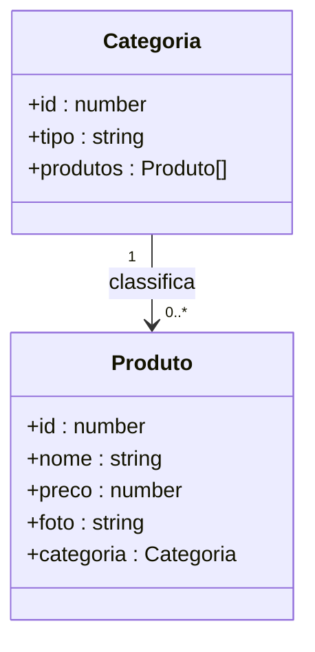
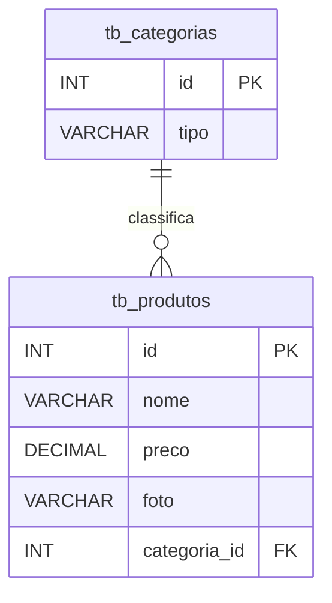

# Projeto Loja Games Generation — Backend com NestJS

<br />

<div align="center">
     
</div>


<br />

<div align="center">
  
  
  
  
  
  
  
</div>

<br />

## Descrição

A **Loja de Games Generation** é uma API REST desenvolvida em **NestJS** e **TypeScript**, responsável por gerenciar os produtos de uma loja de games e suas respectivas categorias.

A aplicação permite realizar operações de **CRUD** (criar, visualizar, atualizar e remover) em produtos e categorias, além de organizar os produtos por meio de relacionamentos entre as entidades.

O projeto foi desenvolvido com fins educacionais, simulando uma aplicação real utilizada em ambientes profissionais, com foco na construção de **APIs REST escaláveis utilizando NestJS e TypeScript**.

Entre os principais recursos disponíveis:

1. Cadastro, edição, consulta e exclusão de **produtos**
2. Cadastro, edição, consulta e exclusão de **categorias**
3. Associação de produtos a uma **categoria**
4. Consulta de produtos por **nome**
5. Filtros de produtos por **faixa de preço**
6. Consulta de categorias que possuem **produtos vinculados**

------


## Sobre esta API

A API foi desenvolvida utilizando **Node.js**, **NestJS** e **TypeScript**, seguindo princípios de:

- Arquitetura modular
- Separação de responsabilidades
- Padrão REST
- Boas práticas de organização de código backend

A aplicação disponibiliza endpoints para gerenciamento dos recursos:

- **Categoria**
- **Produto**

permitindo o cadastro, consulta, atualização e remoção de dados relacionados aos produtos da loja, bem como a associação desses produtos às suas respectivas categorias.

------


## Diagrama de Classes

O diagrama abaixo representa a estrutura lógica das entidades da aplicação e seus relacionamentos dentro da API.



------


## Diagrama Entidade-Relacionamento (DER)


O DER representa como os dados estão organizados no banco relacional e como as entidades se relacionam.


------


## Tecnologias Utilizadas

| Item               | Descrição                         |
| ------------------ | --------------------------------- |
| **Runtime**        | Node.js                           |
| **Linguagem**      | TypeScript                        |
| **Framework**      | NestJS                           |
| **Arquitetura**    | Modular + REST                    |
| **ORM**            | TypeORM                           |
| **Banco de Dados** | MySQL                             |
| **Validação**      | class-validator + class-transform |
| **Documentação**   | Swagger (OpenAPI)                 |
| **Testes**         | Insomnia			                 |

------


## Arquitetura do Projeto

O projeto foi desenvolvido utilizando a arquitetura modular proposta pelo **NestJS**, o que promove organização, escalabilidade e facilidade de manutenção do código.

Cada domínio da aplicação é isolado em um módulo próprio, contendo suas responsabilidades bem definidas:

* **Controller** → recebe e trata requisições HTTP
* **Service** → contém as regras de negócio
* **Entity** → representa as tabelas do banco de dados
* **Repository/ORM** → comunicação com o banco (via TypeORM)

Essa separação de responsabilidades facilita a **manutenção do sistema**, a **evolução da aplicação** e a **reutilização de código**, além de tornar a estrutura do projeto mais clara e escalável.

---


## Estrutura de Pastas

A organização segue o padrão recomendado pelo NestJS:

```bash
📦src
 ┣ 📂produto
 ┣ 📂categoria
 ┣ 📂util
 ┣ 📜app.controller.ts
 ┣ 📜app.module.ts
 ┣ 📜app.service.ts
 ┗ 📜main.ts
```

### Organização por módulo

Exemplo:

```bash
📦produto
 ┣ 📂controllers
 ┃ ┗ 📜produto.controller.ts
 ┣ 📂entities
 ┃ ┗ 📜produto.entity.ts
 ┣ 📂services
 ┃ ┗ 📜produto.service.ts
 ┗ 📜produto.module.ts
```

Esse padrão permite crescimento do sistema sem acoplamento excessivo entre funcionalidades.


---

## Validação de Dados

A aplicação utiliza:

* `class-validator`
* `class-transformer`

para garantir integridade dos dados recebidos pela API.

Exemplo conceitual:

* Campos obrigatórios são verificados automaticamente
* Tipos inválidos são rejeitados antes da regra de negócio
* Respostas de erro seguem padrão HTTP

Isso reduz erros e aumenta a confiabilidade da API.

---


## Boas Práticas Aplicadas

Durante o desenvolvimento foram aplicados conceitos utilizados em projetos reais:

* Organização modular do NestJS
* Separação entre controller e regras de negócio
* Tipagem forte com TypeScript
* Padronização REST
* Estrutura preparada para escalabilidade

---


## Diferenciais Técnicos

Este projeto demonstra competências importantes para desenvolvimento backend moderno:

✅ Construção de API REST com NestJS
✅ Arquitetura modular escalável
✅ Modelagem relacional (Produto → Categoria)
✅ Integração com banco de dados MySQL via ORM
✅ Validação automática de dados
✅ Documentação interativa com Swagger
✅ Uso profissional de TypeScript no backend

---


## Requisitos

Para executar o projeto localmente:

- Node.js 18+
- npm
- MySQL
- Insomnia

------


## Como Executar o Projeto

### Clonando o repositório

```bash
git clone https://github.com/jeaninny/lojagames_generation.git
cd lojagames_generation
```

------

### Instalando as dependências

```bash
npm install
```

------


### Configuração do banco de dados

```bash
configure no arquivo app.module.ts
```


### Executando a aplicação

```bash
npm run start:dev
```

A API será iniciada em:

```
http://localhost:4000
```

------

### Documentação da API

Após iniciar o projeto, acesse:

```
http://localhost:4000
```

O Swagger permitirá:

- visualizar endpoints
- testar requisições
- consultar modelos de dados

------


## Executando os Testes

Para rodar os testes automatizados:

```bash
npm run test
```

------

## Implementações Futuras

* Paginação de resultados
* Upload de imagens para produtos
* Sistema de comentários

------


## Contribuição

Sugestões, melhorias e pull requests são bem-vindos.

Você pode contribuir com:

- Melhorias arquiteturais
- Refatorações
- Testes automatizados
- Documentação

------


## Licença

Este projeto está sob licença **MIT** — livre para uso educacional e profissional.

------


## Autora

**Jeaninny Teixeira - Desenvolvedora Full Stack**

🔗 **GitHub:** https://github.com/jeaninny

🔗 **LinkedIn:** https://www.linkedin.com/in/jeaninnyteixeira

Projeto desenvolvido para **aprendizado contínuo**, **demonstração técnica** e **portfólio profissional**.